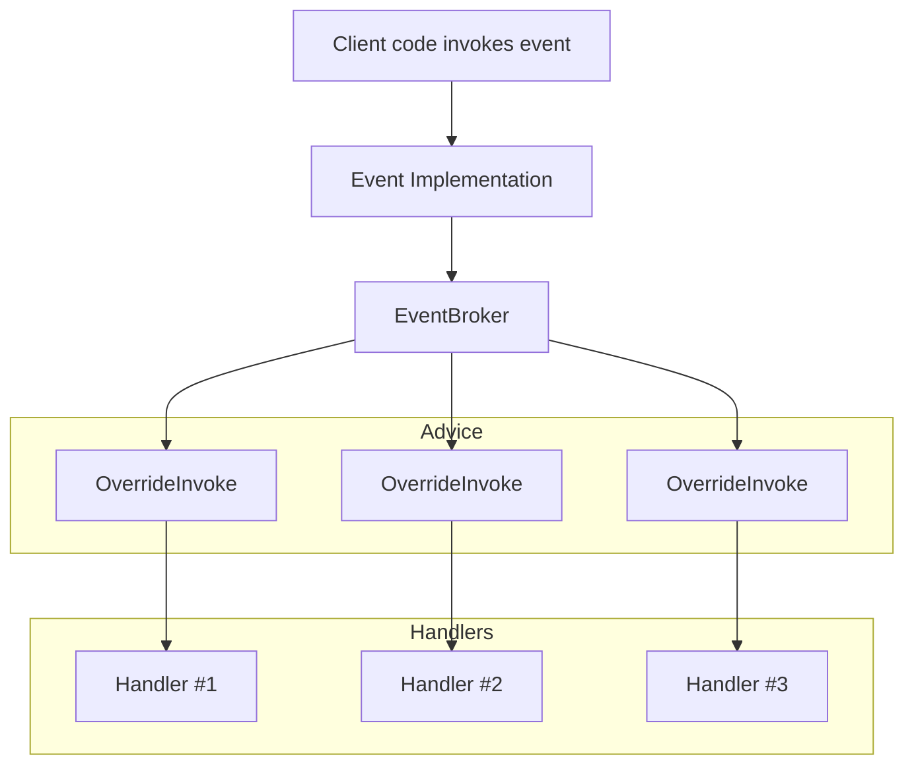

# Overriding events

Metalama allows you to override the three semantics of events: _add_, _remove_, and _invoke_.

To override an event, you can use one of the following approaches:

- Create an aspect class derived from the <xref:Metalama.Framework.Aspects.OverrideEventAspect> class and override the <xref:Metalama.Framework.Aspects.OverrideEventAspect.OverrideAdd*>, <xref:Metalama.Framework.Aspects.OverrideEventAspect.OverrideRemove*>, and <xref:Metalama.Framework.Aspects.OverrideEventAspect.OverrideInvoke*> methods.
- Use the <xref:Metalama.Framework.Aspects.AdviserExtensions.OverrideAccessors*> method from the `BuildAspect` method.

## Overriding the _add_ and _remove_ accessors

Overriding the _add_ and _remove_ accessors of events follows a similar process to [overriding properties](overriding-properties.md).

If you attempt to override a field-like event, it is transformed into an explicitly implemented event and its backing field — just as happens with automatic properties.

### Example: Logging

The following example demonstrates overriding the _add_ and _remove_ accessors of events, without overriding the _invoke_ operation. The example aspect logs the operation of adding and removing handlers to an event. It is applied to both a field-like and an explicitly-implemented event. You can compare the code transformation pattern.

[!metalama-test ~/code/Metalama.Documentation.SampleCode.AspectFramework/EventLogging.cs name="Logging of Events Add/Remove"]

## Overriding the _invoke_ operation

Most of the time, advising an event requires overriding its _invoke_ operation. For instance, if you want to swallow exceptions in event handlers or execute events in a background thread, it's best to do so by overriding the _invoke_ semantic.

To override the _invoke_ semantic, implement the <xref:Metalama.Framework.Aspects.OverrideEventAspect.OverrideInvoke*?text=OverrideEventAspect.OverrideInvoke> method or supply an `invokeTemplate` argument to the <xref:Metalama.Framework.Aspects.AdviserExtensions.OverrideAccessors*> method.

> [!NOTE]
> The `OverrideInvoke` advice is invoked _once per event handler_. If there are 3 event handlers and the event is invoked once, the `OverrideInvoke` advice will be invoked 3 times (see graph below).

### Adding/removing event handlers from an advice

If you are writing an exception handling aspect, you'll want to unregister the event handler from the _invoke_ template. You can do this by invoking the <xref:Metalama.Framework.Code.Invokers.IEventInvoker.Remove*?text=Remove> method from the template, for instance:

```csharp
 meta.Target.Event.Remove( handler );
```

> [!WARNING]
> The <xref:Metalama.Framework.Code.Invokers.IEventInvoker.Raise*?text=Raise> method is not implemented yet.

### Limitations

- Delegate signatures with a non-`void` return type or with `out` and `ref` parameters are not supported.
- Using `meta.Target.Event.Raise()` from the `OverrideInvoke` template is not supported. You must use `meta.Proceed()`.
- Only handlers added through the event's _add_ and _remove_ accessors will be intercepted by the _raise_ advice. Handlers added differently, for instance those added directly to the event backing field, won't be intercepted.

### Example: Safe events

The following aspect implements a "Fool me once, shame on you; fool me twice, shame on me" pattern that handles exceptions in each event handler individually and unregisters any unreliable handler.

[!metalama-test ~/code/Metalama.Documentation.SampleCode.AspectFramework/SafeEvent.cs name="Safe Event"]

The implementation pattern for event invoke operations is more complex than for other advice kinds, as explained below.

### Implementation

Overriding the _invoke_ operation requires a complex code transformation from the Metalama framework. Since the C# language has no standard way to raise an event, the only reliable way to intercept an event invocation is to insert a broker between the event implementation and the event handlers. The broker is implemented by the <xref:Metalama.Framework.RunTime.Events.EventBroker`3> class. Event handlers are added to the broker, and the broker is added as a client of the original implementation.



### Performance considerations

Unlike other advice kinds, advising event invoke operations might affect run-time performance:

- additional memory is required by the <xref:Metalama.Framework.RunTime.Events.EventBroker`3> class (one broker instance per event and per instance of the class, unless the event is `static`).
- raising the event allocates short-term memory because <xref:Metalama.Framework.RunTime.Events.EventBroker`3> relies on <xref:System.MulticastDelegate> and its <xref:System.MulticastDelegate.GetInvocationList> method.
- adding, removing, and raising events require additional type conversions (casts).

This overhead might affect performance for events called at a very high frequency, although high-frequency events are not a frequent use case of .NET events.

> [!div class="see-also"]
> <xref:Metalama.Framework.Aspects.OverrideEventAspect>
> <xref:Metalama.Framework.Aspects.AdviserExtensions.OverrideAccessors*>
> <xref:Metalama.Framework.RunTime.Events.EventBroker`3>
> <xref:overriding-fields-or-properties>
