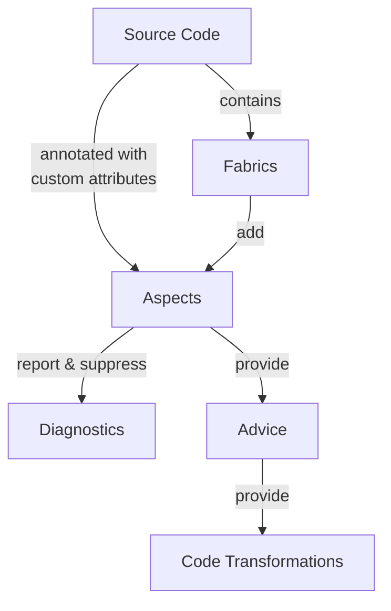
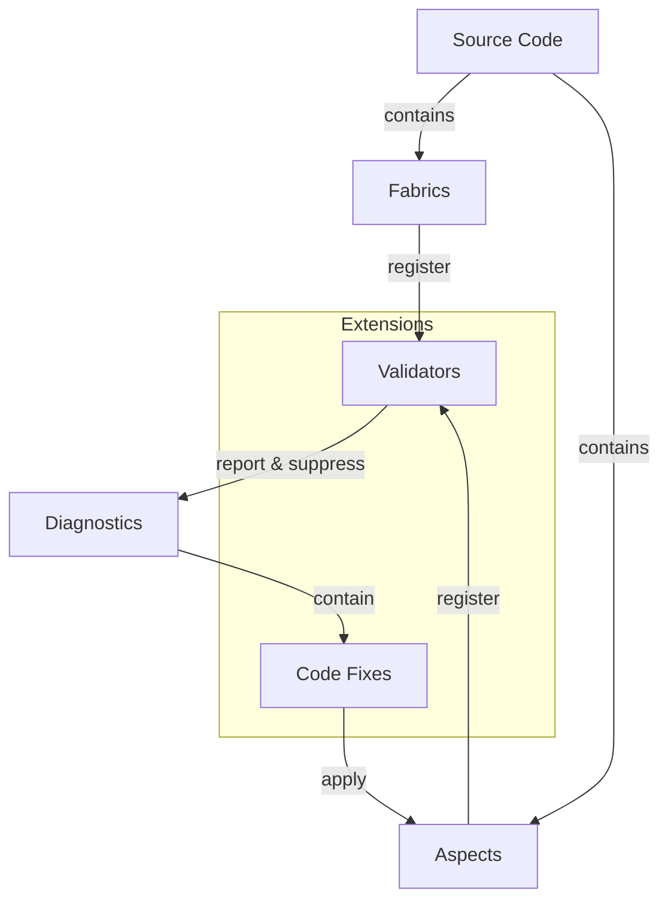

# Metalama architecture

Metalama's architecture consists of a core framework and extension packages that plug into it. This article provides a high-level overview of how these components interact.

## Core components

The following diagram illustrates the core Metalama components:

**Aspects** are the primary building blocks of Metalama. They're applied to your source code through custom attributes or programmatically via fabrics, and can:

- Report and suppress diagnostics
- Provide advice that generates code transformations

**Fabrics** provide a way to apply aspects programmatically. Unlike attribute-based aspects, fabrics exist within your source code and select which declarations receive aspects.

**Advice** specifies the code transformations to apply. Aspects provide advice, which Metalama uses to generate the actual code transformations.

**Diagnostics** are warnings or errors reported by aspects. They provide feedback about code issues during compilation and in the IDE.

## Extension packages

Metalama provides extension packages that add capabilities through an extensibility mechanism. These packages integrate with the core framework but are distributed separately.

> [!NOTE]
> The extensibility mechanism used by these packages is public but not part of the supported SDK and is subject to change.

**Validators** (from <xref:Metalama.Extensions.Validation>) perform code analysis. They can be registered by aspects or fabrics, and report or suppress diagnostics based on your code's compliance with defined rules.

**Code fixes** (from <xref:Metalama.Extensions.CodeFixes>) are suggested solutions attached to diagnostics. They appear in the IDE lightbulb menu and can apply aspects to fix issues automatically.

> [!div class="see-also"]
> <xref:aspects>
> <xref:fabrics>
> <xref:aspect-design>
> <xref:advising-code>
> <xref:diagnostics>
> <xref:validation>
