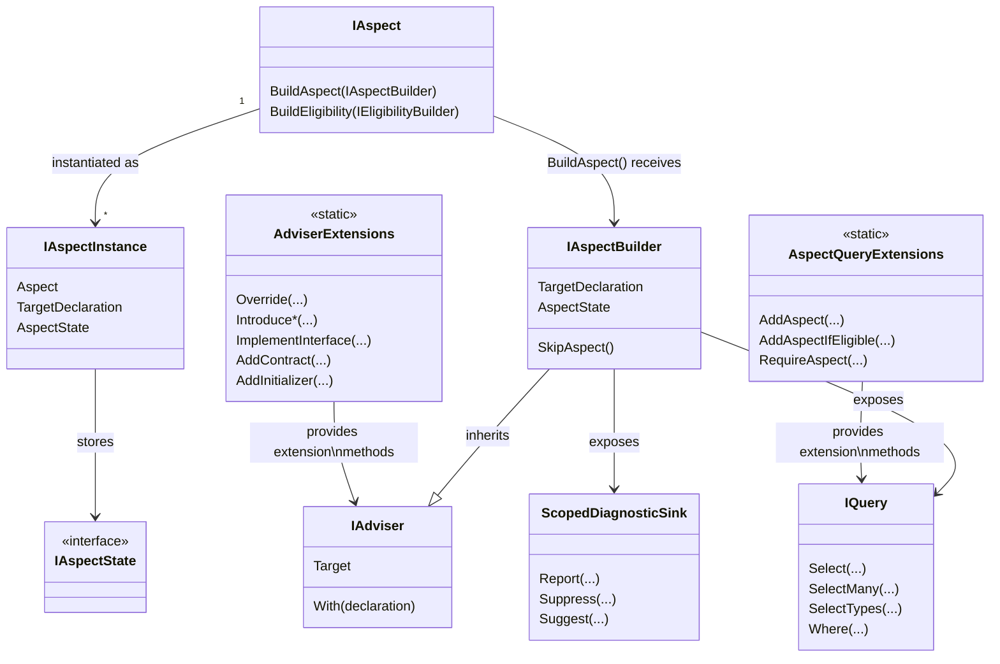

# Understanding the aspect framework design

Until now, you've learned how to create simple aspects using the <xref:Metalama.Framework.Aspects.OverrideMethodAspect> and <xref:Metalama.Framework.Aspects.OverrideFieldOrPropertyAspect>. These classes can be viewed as _API sugar_, designed to simplify the creation of your first aspects. Before going deeper, you need to understand the design of the Metalama aspect framework.

## Class diagram

By definition, an aspect is a class that implements the <xref:Metalama.Framework.Aspects.IAspect`1> generic interface. The generic parameter of this interface represents the type of declarations to which the aspect can be applied. For instance, an aspect applicable to a method must implement the `IAspect<IMethod>` interface, while an aspect applicable to a named type must implement `IAspect<INamedType>`.

The aspect author can utilize the <xref:Metalama.Framework.Aspects.IAspect`1.BuildAspect*> method, inherited from the <xref:Metalama.Framework.Aspects.IAspect`1> interface, to construct the aspect _instance_ applied to a specific _target declaration_, using an <xref:Metalama.Framework.Aspects.IAspectBuilder`1>.

## Design principles

### BuildAspect is the entry point

The <xref:Metalama.Framework.Aspects.IAspect`1.BuildAspect*> method is called once for each target declaration to which the aspect is applied. This method receives an <xref:Metalama.Framework.Aspects.IAspectBuilder`1>, which provides access to the target declaration and exposes methods to add advice (code transformations), report or suppress diagnostics, and perform other tasks.

### Aspects are both compile-time and run-time objects

Aspects can optionally be custom attributes (by deriving from <xref:System.Attribute>). In this case, aspect classes exist both at compile time (when Metalama executes them) and at run time (as standard .NET attributes accessible via reflection).

This dual nature has important implications:

- Aspect properties set in source code (e.g., `[Log(Category = "Security")]`) are available both to `BuildAspect` at compile time and to reflection at run time.
- Run-time code can query aspects using standard reflection APIs like `GetCustomAttributes`.

### Aspects are serializable

All aspects are serializable. However, serialization is only used for inheritable aspects in cross-project scenarios. For details, see <xref:aspect-serialization>.

### Aspects must be immutable

Aspects must be designed as **immutable classes**. Never store state in aspect fields from the `BuildAspect` method if that state depends on the target declaration.

Aspect instances are not necessarily associated with a single target declaration. When aspects are inherited or added through fabrics, **the same <xref:Metalama.Framework.Aspects.IAspect> instance is shared by many target declarations**. The `BuildAspect` method is called many times, once per target. If you store target-specific state in a field, that state will be shared across all targets, leading to incorrect behavior.

Target-specific data is represented by <xref:Metalama.Framework.Aspects.IAspectInstance>, which pairs an `IAspect` with a specific target declaration. If you need to store target-specific state that must be accessible to other aspects or validators, use <xref:Metalama.Framework.Aspects.IAspectState> via the <xref:Metalama.Framework.Aspects.IAspectBuilder.AspectState> property. For details, see <xref:sharing-state-with-advice>.

For strategies to pass state from `BuildAspect` to templates without storing it in aspect fields, see <xref:sharing-state-with-advice>.

## Abilities of aspects

### 1. Transforming code

Aspects can perform the following transformations to code:

- Apply a template to an existing method, i.e., add generated code to user-written code.
- Introduce a newly generated member to an existing type.
- Implement an interface into a type.

For more details, refer to <xref:advising-code>.

### 2. Reporting, suppressing diagnostics, and suggesting code fixes

Aspects can report diagnostics (a term encompassing errors, warnings, and information messages) and suppress diagnostics reported by the C# compiler, analyzers, or other aspects.

Aspects can suggest code fixes for any diagnostic they report or propose code refactorings.

For more information about this feature, refer to <xref:diagnostics>.

### 3. Performing advanced code validations

The <xref:Metalama.Framework.Aspects.IAspectBuilder`1.Outbound?text=builder.Outbound> property allows registering validators for advanced scenarios:

- Validate the target declaration after it has been transformed by all aspects.
- Validate any _references_ to the target declaration.

Refer to <xref:aspect-validating>.

### 4. Adding other aspects to be applied

The <xref:Metalama.Framework.Aspects.IAspectBuilder`1.Outbound?text=builder.Outbound> property also allows adding other aspects to the target code.

Refer to <xref:child-aspects>.

### 5. Defining its eligibility

Aspects can define which declarations they can be legally applied to.

Refer to <xref:eligibility>.

### 6. Disabling itself

If an aspect instance decides it can't be applied to its target, its implementation of the <xref:Metalama.Framework.Aspects.IAspect`1.BuildAspect*> method can call the <xref:Metalama.Framework.Aspects.IAspectBuilder.SkipAspect> method. This method prevents the aspect from providing any advice or child aspect and sets the <xref:Metalama.Framework.Aspects.IAspectInstance.IsSkipped> to `true`.

The aspect may or may not report a diagnostic before calling <xref:Metalama.Framework.Aspects.IAspectBuilder.SkipAspect>. Calling this method doesn't report any diagnostic.

### 7. Customizing its appearance in the IDE

By default, an aspect class is represented in the IDE by the class name trimmed of its `Attribute` suffix, if any. To override the default name, annotate the aspect class with the <xref:System.ComponentModel.DisplayNameAttribute> annotation.

## Examples

### Example: an aspect targeting methods, fields, and properties

The following example demonstrates an aspect that targets methods, fields, and properties with a single implementation class. The aspect implements `IAspect<IMethod>`, `IAspect<IFieldOrProperty>`, and uses the `BuildAspect` method to add logging behavior to each target type.

[!metalama-test ~/code/Metalama.Documentation.SampleCode.AspectFramework/LogMethodAndProperty.cs name="Aspect Targeting Methods, Fields and Properties"]

> [!div class="see-also"]
> <xref:aspects>
> <xref:Metalama.Framework.Aspects.IAspect`1>
> <xref:Metalama.Framework.Aspects.IAspectBuilder`1>
> <xref:Metalama.Framework.Aspects.IAspectState>
> <xref:Metalama.Framework.Aspects.AdviserExtensions>
> <xref:sharing-state-with-advice>
> <xref:aspect-serialization>
