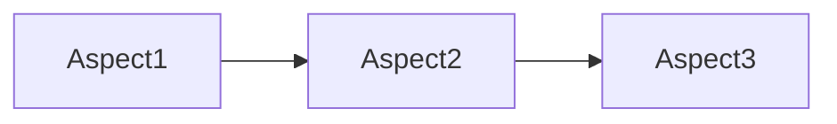
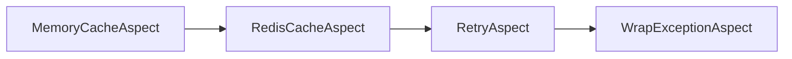

# Ordering aspects

When you define multiple aspect classes, execution order becomes critical.

## Concepts

### Per-project ordering

> [!NOTE]
> Defining the execution order is the primary responsibility of the aspect library author, not the users of the aspect library. Aspect libraries that know about each other should set their execution order properly to avoid user confusion.

Each aspect library should define the execution order of the aspects it introduces. This order should consider not only aspects within the same library but also aspects defined in referenced aspect libraries.

When a project employs two unrelated aspect libraries or contains aspect classes, it must define the ordering within the project itself.

### Order of application versus order of execution

Metalama adheres to the "matryoshka" model: your source code is the innermost doll, and aspects are added _around_ it. The fully compiled code, including all aspects, resembles a fully assembled matryoshka. Executing a method is like disassembling the matryoshka: you start with the outermost shell and progress to the original implementation.


Remember that while Metalama, at _build time_, constructs the matryoshka from the inside out, at _run time_, the code is executed from the outside in—in other words, the source code is executed _last_.

Therefore, the build-time order of applying aspects and the run-time order of executing aspects are usually _opposite_.

## Specifying the execution order

By default, aspects execute in alphabetical order at run time. This order isn't intended to be correct, but at least it's deterministic.

Define the execution order using the <xref:Metalama.Framework.Aspects.AspectOrderAttribute> assembly-level custom attribute. The order of the aspect classes in the attribute corresponds to their execution order. To avoid ambiguities, you must explicitly supply the <xref:Metalama.Framework.Aspects.AspectOrderDirection> value (`RunTime` or `CompileTime`) for which you're specifying the aspect order.

The following two snippets are equivalent:

```cs
using Metalama.Framework.Aspects;
[assembly: AspectOrder( AspectOrderDirection.RunTime, typeof(Aspect1), typeof(Aspect2), typeof(Aspect3))]
```

```cs
using Metalama.Framework.Aspects;
[assembly: AspectOrder( AspectOrderDirection.CompileTime, typeof(Aspect3), typeof(Aspect2), typeof(Aspect1))]
```

These custom attributes define the run-time execution order:



### Partial relationships

You can specify _partial_ order relationships. The aspect framework will merge all partial relationships and determine the global order for the current project.

For instance, the following code snippet is equivalent to the previous ones:

```cs
using Metalama.Framework.Aspects;
[assembly: AspectOrder( AspectOrderDirection.RunTime, typeof(Aspect1), typeof(Aspect2))]
[assembly: AspectOrder( AspectOrderDirection.RunTime, typeof(Aspect2), typeof(Aspect3))]
```

These two attributes define the following relationships:

This is like mathematics: if we have `a < b` and `b < c`, then we have `a < c`, and the ordered sequence is `{a, b, c}`.

If you specify conflicting relationships or import an aspect library that defines a conflicting order, Metalama emits a compilation error.

> [!NOTE]
> Metalama merges all `[assembly: AspectOrder(...)]` attributes that it finds not only in the current project but also in all referenced projects or libraries. Therefore, you don't need to repeat the `[assembly: AspectOrder(...)]` attributes in all projects that use aspects. It's sufficient to define them in projects that define aspects.

### Inherited aspects

By default, relationships specified with <xref:Metalama.Framework.Aspects.AspectOrderAttribute> also apply to derived aspect classes.

For instance, consider the following aspects:

```c#
abstract class ExceptionHandlingAspect;
class RetryAspect : ExceptionHandlingAspect;
class WrapExceptionAspect : ExceptionHandlingAspect;

abstract class CacheAspect;
class B1 : MemoryCacheAspect;
class B2 : RedisCacheAspect;
```

Consider the following order attributes, ordering only abstract aspects:

```cs
using Metalama.Framework.Aspects;
[assembly: AspectOrder( AspectOrderDirection.RunTime, typeof(CacheAspect), typeof(ExceptionHandlingAspect))]
```

We don't explicitly order concrete aspect classes, so alphabetical ordering automatically applies.

The resulting run-time aspect order is as follows:



To disable this behavior, set the <xref:Metalama.Framework.Aspects.AspectOrderAttribute.ApplyToDerivedTypes> property to `false`.

### How does it work?

Under the hood, Metalama performs a [topological sort](https://en.wikipedia.org/wiki/Topological_sorting) on a graph composed of all relationships found in the current project and all its dependencies.

When a pair of aspects don't have any specific ordering relationship from any source, Metalama falls back to _alphabetical_ ordering to avoid non-determinism.

### Example

The following code snippet demonstrates two aspects that add a method to the target type and display the list of methods defined on the target type before the aspect was applied. The execution order is defined as `Aspect1 < Aspect2`. From this example, you can see that the order of application of aspects is opposite. `Aspect2` is applied first and sees the source code, then `Aspect1` is applied and sees the method added by `Aspect2`. The modified method body of `SourceMethod` shows that the aspects are executed in this order: `Aspect1`, `Aspect2`, then the original method.

[!metalama-test  ~/code/Metalama.Documentation.SampleCode.AspectFramework/Ordering.cs name="Ordering"]

> [!div class="see-also"]
> <xref:aspects>
> <xref:same-type-multiple-instances>
> <xref:aspect-composition>
> <xref:fabrics-advising>
> <xref:Metalama.Framework.Aspects.AspectOrderAttribute>
> <xref:Metalama.Framework.Aspects.AspectOrderDirection>
> <xref:Metalama.Framework.Aspects.LayersAttribute>
> <xref:Metalama.Framework.Aspects.IAspectInstance>
