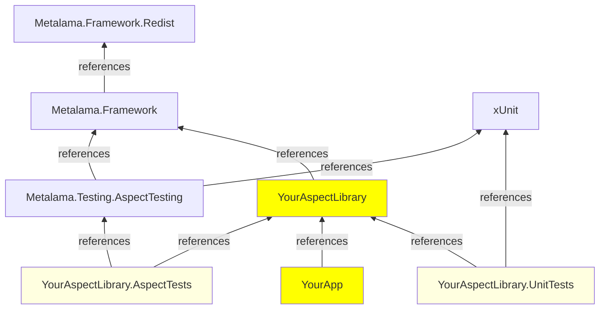
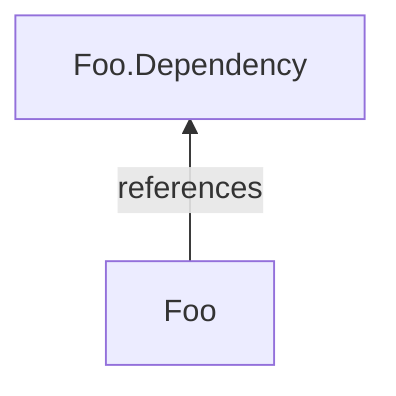

# Snapshot testing of aspects

Snapshot testing (also known as approval testing or golden master testing) is a technique where the actual output of a test is compared against a stored baseline file. This approach is widely used in testing frameworks like Jest, Verify, and ApprovalTests.

In Metalama, snapshot testing involves creating _input_ test files annotated with aspects and _output_ test files containing the transformed code (possibly with comments for errors and warnings). The testing framework automatically executes inputs and verifies that the outputs match the expected baselines.

Follow these steps (detailed below):

1. Create a test project.
2. For each test case:
   1. Create an input file, for example, `MyTest.cs`, and write some code annotated with the aspect custom attribute.
   2. Run the test and inspect the test output window.
   3. Verify the transformed code visually. Fix bugs until the transformed code is as expected.
   4. Copy the test output to a file named with the extension `.t.cs`, for example, `MyTest.t.cs`.

> [!NOTE]
> For a real-world example, see [the Metalama.Samples repo on GitHub](https://github.com/metalama/Metalama.Samples). Sample aspects are tested using the approach described here.

## Step 1. Create an aspect test project with Metalama.Testing.AspectTesting

1. Create an xUnit test project.
2. Add the `Metalama.Testing.AspectTesting` package (see <xref:packages> for details).

> [!WARNING]
> Don't add `Metalama.Testing.AspectTesting` to a project you don't intend to use _exclusively_ for snapshot tests. This package significantly changes the semantics of the project items.

Typically, the `csproj` project file of a snapshot test project would have this content:

```xml
<Project Sdk="Microsoft.NET.Sdk">

    <PropertyGroup>
        <OutputType>Library</OutputType>
        <TargetFramework>net9.0</TargetFramework>
    </PropertyGroup>

    <ItemGroup>
        <PackageReference Include="Microsoft.NET.Test.Sdk" Version="16.7.1" />
        <PackageReference Include="xunit" Version="2.4.1" />
        <PackageReference Include="xunit.runner.visualstudio" Version="2.4.3">
            <IncludeAssets>runtime; build; native; contentfiles; analyzers; buildtransitive</IncludeAssets>
            <PrivateAssets>all</PrivateAssets>
        </PackageReference>
        <PackageReference Include="Metalama.Framework" />
        <PackageReference Include="Metalama.Testing.AspectTesting" />
    </ItemGroup>

</Project>
```

### Dependency graph

The following diagram illustrates the typical dependencies between your projects and our packages.



### Customizations performed by Metalama.Testing.AspectTesting

When you import the `Metalama.Testing.AspectTesting` package into a project, these customizations occur:

1. The `MetalamaEnabled` project property is set to `False`, which completely disables Metalama for the project. The `METALAMA` compilation symbol (usable in a directive like `#if METALAMA`) is no longer defined.
2. Expected test results (`*.t.cs`) are excluded from the compilation.
3. The Xunit test framework is customized to execute tests from standalone _files_ instead of from methods annotated with `[Fact]` or `[Theory]`.

## Step 2. Add a test case

Every source file in the project is a standalone test case. It usually contains some source code to which your aspect is applied, but it can also contain an aspect. You can consider that every file constitutes a project in itself, and this small project receives the project references of the parent compile-time project.

Every test includes:

- A main test file, named for instance `BlueSky.cs`.
- A file containing the _expected transformed code_ of the main test file, named with the `.t.cs` extension, for example, `BlueSky.t.cs`. Don't create this file manually—copy the actual output of the test after you're satisfied with it (see below).
- Optionally, one or more auxiliary test files whose name starts with the main test file, for example, `BlueSky.*.cs`. Auxiliary files are included in the test compilation, but their transformed code isn't appended to the `.t.cs` file.

> [!NOTE]
> The name of the main file of your test case can't include a `.` except for the `.cs` extension.

Suppose we're testing the following aspect. This file would typically be included in a class library project.

[!metalama-test  ~/code/Metalama.Documentation.SampleCode.AspectFramework/Testing.TheAspect.cs name="Main"]

To test this aspect, we create a test file with the following content:

[!metalama-test  ~/code/Metalama.Documentation.SampleCode.AspectFramework/Testing.cs name="Main"]

### Excluding files from test discovery

Files whose name starts with an underscore (`_`) are not recognized as tests. This is useful for shared helper files that should be included in multiple tests but shouldn't run as standalone tests themselves.

To include such files in a test, use the `@Include` directive as described below.

### Include other files

To include other files in the test compilation beyond auxiliary files based on file name, add a comment of this form in the main test file:

```cs
// @Include(../Path/To/The/File.cs)
```

The included file will behave just as an auxiliary file. This is particularly useful for including files that start with `_` or files from other directories.

### Including references to introduced members and interfaces

Because Metalama is disabled at compile-time and design-time for a test project, you'll have difficulties referencing members that don't stem from your source code but have been introduced by an aspect. Since the IDE and the compiler don't know about Metalama, you'll get errors complaining that these members don't exist.

The solution is to wrap the code accessing introduced members with a `#if METALAMA` directive. Because the `METALAMA` symbol is defined when the test framework is running, this code will be considered during these tests. However, this code will be ignored while editing and compiling because it isn't defined at design time and compile time.

For instance, if an aspect introduces the `Planet.Update` method:

```cs
Planet p = new();
#if METALAMA
p.Update( x, y );
#endif
Console.WriteLine( $"{p.X}, {p.Y}");
```

For details about member introductions, see <xref:introducing-members>.

## Step 3. Run the test case

When you create a new test file, your IDE doesn't automatically discover it. To make the new test appear in Test Explorer, build the project first. After the build, the test should appear in Test Explorer, and you'll be able to execute tests individually.

> [!NOTE]
> If you're using Rider, configure the xUnit adapter for test discovery first. See <xref:ide-rider> for details.

You can also run tests using `dotnet test`.

The output code, transformed by your aspects, is available at two locations:

- in the _additional output_ of the test message,
- under the `obj/Debug/XXX/transformed` folder, with the name `*.t.cs`.

For the example above, the test output is:

[!metalama-test  ~/code/Metalama.Documentation.SampleCode.AspectFramework/Testing.t.cs name="Testing"]

Verify that the output code matches your expectations. If necessary, fix your aspect and rerun the test. Repeat as many times as necessary.

> [!NOTE]
> To debug your aspect's compile-time logic, you cannot use regular IDE breakpoints. Instead, insert `Debugger.Break()` or `meta.DebugBreak()` directly in your code, then run the test with the debugger attached. For details, see <xref:debugging-aspects>.

## Step 4. Copy the test output to the expected output

Once the `.t.cs` file is satisfactory, copy the test output to this file. For instance, if your test file is named `MyTest.cs`, copy the test output to the file named `MyTest.t.cs`.

> [!WARNING]
> The _Paste_ command of Visual Studio can reformat the code and break the test.

To accept the output of all tests:

1. Commit or stage the changes in your repository, so you can review and possibly roll back the consequences of the next steps.
2. Run the following sequence of commands:

    ```powershell
    # Make sure there is no garbage in the obj\transformed from another commit.
    dotnet build -t:CleanTestOutput

    # Run the tests (it does not matter if they fail)
    dotnet test

    # Copy the actual output to the expected output
    dotnet build -t:AcceptTestOutput
    ```

3. Review each modified file in your repository using the diff tool.

## Skipping a test

To skip a test, add the following comment to the file:

```cs
// @Skipped(I do not want it to run)
```

The text between the parentheses is the skip reason.

## Advanced features

### Excluding a directory

All files in a snapshot test project are turned into test input files by default. To disable this behavior for a directory, create a file named `metalamaTests.json` and add the following content:

```json
{ "Exclude": true }
```

### Specifying test options

The Metalama test framework supports several test options. They are documented in the <xref:Metalama.Testing.AspectTesting.TestOptions> class.

To set a test option, add a special comment to the test file, for instance:

```cs
// @IncludeAllSeverities
```

Alternatively, to set an option for the whole directory, create a file named `metalamaTests.json` and add properties of the <xref:Metalama.Testing.AspectTesting.TestOptions> class. For instance:

```json
{ "IncludeAllSeverities": true }
```

### Trimming the test output to one or two classes

To limit the test output to one or more declarations (instead of the whole transformed input file), add the `// <target>` comment to the declarations that must be included. This comment must be at the top of any custom attribute on this declaration, and its spacing must be exactly as shown.

Example:

```cs
class NotIncluded {}

// <target>
class Included {}
```

If no `// <target>` comment is found in the file, the whole file is considered.

### Creating a dependent project

To create a multi-project test, create a dependent project by adding a file named `Foo.Dependency.cs` to your test, where `Foo.cs` is your principal test file.



## Running tests in Rider or ReSharper

For detailed configuration instructions for Rider and ReSharper, see <xref:ide-rider>.

## Obsolete APIs

> [!WARNING]
> The `AspectTestClass`, `DefaultAspectTestClass`, `CurrentDirectoryAttribute`, and `CurrentProjectAttribute` classes are obsolete and shouldn't be used. These classes were previously required to manually create test runners, but the `Metalama.Testing.AspectTesting` package now provides automatic test discovery. Simply add the package to your project and place test files in the project directory—no additional test runner code is needed.
>
> Legacy code using `_Runner.cs` files with `AspectTestClass` and `[CurrentDirectory]` will continue to work but isn't recommended for new projects.

> [!div class="see-also"]
> <xref:testing>
> <xref:compile-time-testing>
> <xref:run-time-testing>
> <xref:debugging-aspects>
> <xref:Metalama.Testing.AspectTesting>
> <xref:Metalama.Testing.AspectTesting.TestOptions>
