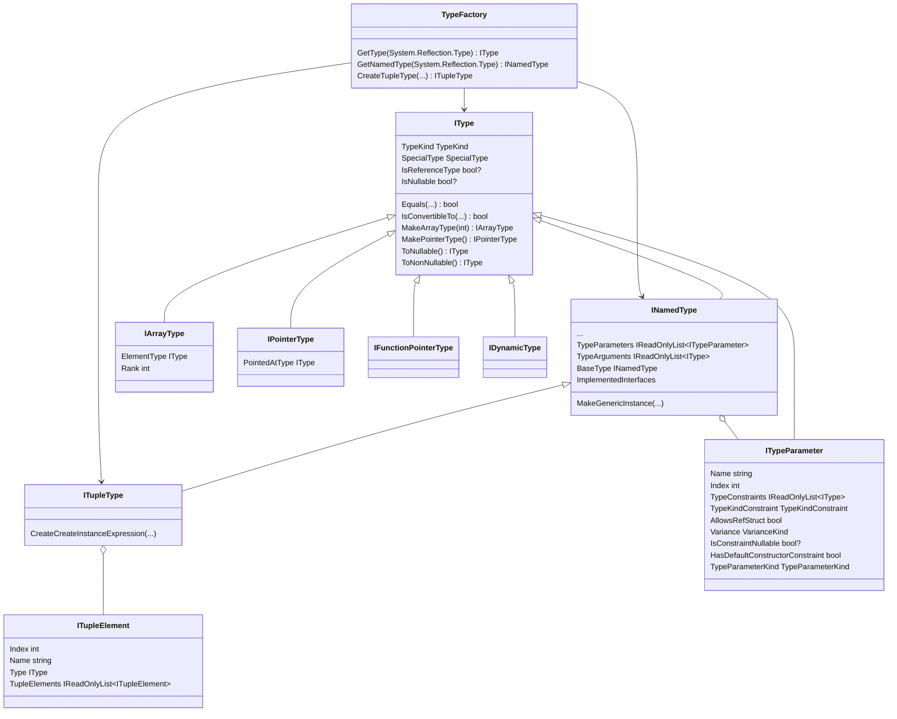

# Working with types

The Metalama type system represents C# types through the <xref:Metalama.Framework.Code.IType> interface and its derived types. It's aligned with the C# type system and Roslyn but differs from `System.Reflection`.

## Class diagram



## Kinds of types

The type system in Metalama distinguishes between:

- **Named types** (<xref:Metalama.Framework.Code.INamedType>) - Classes, structs, interfaces, intrinsics like `string` or `void`, etc.
- **Tuple types** (<xref:Metalama.Framework.Code.ITupleType>) - Like `(double X, double Y, double Z)` or `(int, string)`.
- **Array types** (<xref:Metalama.Framework.Code.Types.IArrayType>) - Like `int[]` or `string[,]`
- **Pointer types** (<xref:Metalama.Framework.Code.Types.IPointerType>) - Like `int*`
- **Type parameters** (<xref:Metalama.Framework.Code.ITypeParameter>) - Generic parameters like `T` in `List<T>`
- **Dynamic type** (<xref:Metalama.Framework.Code.Types.IDynamicType>) - The `dynamic` type.
- **Function pointers**  (<xref:Metalama.Framework.Code.Types.IFunctionPointerType>) are not fully supported in Metalama.

## Named types

A named type in Metalama is represented by the <xref:Metalama.Framework.Code.INamedType> interface and corresponds to any type that has a name in C#: classes, structs, interfaces, enums, delegates, and records.

Named types are the fundamental building blocks of C# programs. Unlike other types in the type system (such as arrays, pointers, or type parameters), named types:

- Have a fully qualified name (e.g., `System.Collections.Generic.List<T>`).
- Can contain members (methods, properties, indexers, fields, events, constructors, extension blocks).
- Can implement interfaces and inherit from base types.
- Can have nested types.
- Can be generic (with type parameters).

Tuple types, represented by the <xref:Metalama.Framework.Code.ITupleType> interface, are also named types because <xref:Metalama.Framework.Code.ITupleType> derives from <xref:Metalama.Framework.Code.INamedType>.

> [!WARNING]
> Extension blocks (<xref:Metalama.Framework.Code.IExtensionBlock>), despite implementing <xref:Metalama.Framework.Code.INamedType> interface, are not types.

### Examples of named types

```csharp
// Classes
public class Customer;
public record Person(string Name, int Age);

// Structs
public struct Point;
public record struct Point( float X, float Y );

// Interfaces
public interface IRepository;

// Enums
public enum Status;

// Delegates
public delegate void EventHandler();

// Generic types
public class List<T>;

// Nested types
public class Customer
{
    public class Builder;
}

// Tuple types
(string Name, int Age)
```

## Getting an IType object

There are several ways to get an `IType` instance from your compile-time code.

### From `typeof(.)`

You can use the <xref:Metalama.Framework.Code.TypeFactory.GetType*?text=TypeFactory.GetType> and <xref:Metalama.Framework.Code.TypeFactory.GetNamedType*?text=TypeFactory.GetNamedType> methods to map a `System.Type` to the corresponding <xref:Metalama.Framework.Code.IType> or <xref:Metalama.Framework.Code.INamedType>.

```csharp
var stringType = TypeFactory.GetNamedType(typeof(string));
var stringArrayType = TypeFactory.GetType(typeof(string[]));
```

> [!WARNING]
> Metalama doesn't support the full `System.Type` API at compile time for types that represent run-time types. `typeof` expressions work with run-time types and return an opaque implementation of the `System.Type` abstract type, which doesn't allow you to use other features of the system reflection API.

### From special types (intrinsics and other)

Some types are identified by a member of the <xref:Metalama.Framework.Code.SpecialType> enum. Using the <xref:Metalama.Framework.Code.TypeFactory.GetType(Metalama.Framework.Code.SpecialType)?text=TypeFactory.GetType(SpecialType)> method is often more compact and efficient than using `typeof`.

```csharp
var stringType = TypeFactory.GetType( SpecialType.String );
```

### From the current project

You can get any type of the current project by querying the `ICompilation` object.

> [!WARNING]
> For best performance, avoid enumerating all types of all namespaces. Instead, whenever possible, navigate the namespaces and select the desired type using the `OfName` method.

```csharp
// From the compilation, in the context of a template
var myType = meta.Target.Compilation
    .GlobalNamespace
    .GetDescendant("My.Namespace")
    .Types
    .OfName( "MyClass" );
```

### Generic types

Generic types in Metalama are represented by types that implement the <xref:Metalama.Framework.Code.IGeneric> interface. Both <xref:Metalama.Framework.Code.INamedType> and <xref:Metalama.Framework.Code.IMethod> implement this interface.

Type parameters are represented by <xref:Metalama.Framework.Code.ITypeParameter>. You can access them through the following collections:

- <xref:Metalama.Framework.Code.IGeneric.TypeParameters?text=IGeneric.TypeParameters> expose the type parameters, i.e. `T` for an instance `List<int>` of the type definition `List<T>`.
- <xref:Metalama.Framework.Code.IGeneric.TypeArguments?text=IGeneric.TypeArguments> expose the type arguments, i.e. the type bound to the arguments, i.e. `int` for an instance `List<int>` of the type definition `List<T>`.

Unlike MSIL, Metalama doesn't have a concept of "open" generic type with unbound type parameters. Type parameters are always bound to an argument. In generic type definitions, the type parameters are bound to themselves.

Consider the type `List<T>`, where `T` is a type parameter. In the generic type instance `List<int>`, `T` is the type parameter, `int` is the type argument, and the `T` parameter is bound to `int`. In the type definition `List<T>`, `T` is both the type parameter and the type argument because `T` is bound to itself.

The `IGeneric` interface exposes the `IsCanonicalGenericInstance` property, which returns `true` if all type parameters are bound to themselves.

### Creating generic instances

Use <xref:Metalama.Framework.Code.INamedType.MakeGenericInstance*> to create a generic type instance from a generic definition:

```csharp
// Get the generic definition of List<T>
var listDefinition = TypeFactory.GetNamedType(typeof(List<>));

// Create List<string>
var stringType = TypeFactory.GetType( SpecialType.String );
var listOfString = listDefinition.MakeGenericInstance( [stringType] );
```

You can also use the following, more compact, syntax:

```csharp
var listOfString = TypeFactory.GetNamedType( typeof(List<>) ).MakeGenericInstance( [typeof(string)] );
```

## Tuple types

It is often convenient to use tuples when an aspect needs to pack all method arguments into a single object. They are an efficient alternative to `object[]`.

Tuple types in Metalama are represented by <xref:Metalama.Framework.Code.ITupleType>, which exposes the tuple elements under the `TupleElements` property. Tuple elements have a type and a name.

In C#, tuple types are syntactic sugar over the `System.ValueType` type. In Metalama, the `System.ValueType` is represented by the `INamedType` interface from which `ITupleType` is derived.

### Creating tuple types

Use <xref:Metalama.Framework.Code.TypeFactory.CreateTupleType*> to create a tuple type.

The following code snippet creates the tuple type `(decimal Quantity, string ProductCode)`:

```csharp
// Create a tuple type from individual types
var tupleType = TypeFactory.CreateTupleType( (typeof(decimal), "Quantity"), (typeof(string), "ProductCode" ) );
```

### Creating and accessing tuple instances

Use <xref:Metalama.Framework.Code.ITupleType.CreateCreateInstanceExpression*> to create a tuple instantiation expression.

For instance, in a template, you can use the following code:

```csharp
var tupleType = TypeFactory.CreateTupleType( (typeof(decimal), "Quantity"), (typeof(string), "ProductCode" ) );
var tupleInstance = tupleType.CreateCreateInstanceExpression(42, "HAT").Value;
```

This will generate the following code:

```csharp
var tupleInstance = (Quantity: 42, ProductCode: "HAT");
```

Tuple elements are represented as fields in the tuple type. Use the following syntax to access their value:

```csharp
// Get the first element of a tuple
var firstElement = tupleType.TupleElements[0].WithObject( tupleInstance ).Value;
```

### Degenerate cases

Metalama handles special cases gracefully:

- **Zero-element tuples**: Generates `ValueTuple.Create()`.
- **One-element tuples**: Generates `ValueTuple<T>`.
- **Two or more elements**: Generates the native tuple syntax `(T1 Value1, T2 Value2, ...)`.

```csharp
// Zero arguments
var emptyTupleType = TypeFactory.CreateTupleType();
var emptyTuple = emptyTupleType.CreateCreateInstanceExpression().Value
// Result: `var emptyTuple = ValueTuple.Create();`

// One argument
var singleTupleType = TypeFactory.CreateTupleType( typeof(int) );
var singleTuple = singleTupleType.CreateCreateInstanceExpression( 42 ).Value;
// Result: `var singleTuple = ValueTuple.Create( 42 );`

// Multiple arguments
var normalTupleType = TypeFactory.CreateTupleType( (intType, "Quantity"), (stringType, "ProductCode") );
var normalTuple = normalTuple.CreateCreateInstanceExpression( 42, "HAT" );
// Result: `var normalTuple = ( Quantity: 42, ProductCode: "HAT" );`
```

### Example: packing and unpacking arguments into a tuple

The following aspect demonstrates how you can pack all method arguments into a tuple so that they can be passed as a single object to an interceptor. The tuple is then unpacked into an argument list on the other side of the interceptor.

This example is quite convoluted because of the need to implement a basic interception pattern. You can skip it on first reading if you're just here to learn about the type system and don't want to dive into more complex aspects for now.

Despite the complexity due to the interception scenario, the aspect demonstrates the simplicity of working with tuples. The aspect code doesn't need to bother about the number of parameters. All details are taken care of by <xref:Metalama.Framework.Code.ITupleType>.

[!metalama-test ~/code/Metalama.Documentation.SampleCode.AspectFramework/TupleInterceptor.cs name="TupleInterceptor"]

## Creating array types

Use the <xref:Metalama.Framework.Code.IType.MakeArrayType*?text=IType.MakeArrayType> method to create an array type from an element type. You can optionally specify the rank (number of dimensions) as a parameter:

```csharp
// Single-dimensional array (rank defaults to 1)
var intType = TypeFactory.GetType(typeof(int));
var intArrayType = intType.MakeArrayType(); // int[]

// Multi-dimensional array
var int2DArrayType = intType.MakeArrayType(2); // int[,]
var int3DArrayType = intType.MakeArrayType(3); // int[,,]
```

The resulting <xref:Metalama.Framework.Code.Types.IArrayType> provides access to the element type and array rank:

```csharp
var arrayType = intType.MakeArrayType(2);
var elementType = arrayType.ElementType; // IType representing int
var rank = arrayType.Rank; // 2
```

## Creating pointer types

Use the <xref:Metalama.Framework.Code.IType.MakePointerType*?text=IType.MakePointerType> method to create a pointer type from an element type. Note that pointers are only valid for unmanaged types:

```csharp
var intType = TypeFactory.GetType(typeof(int));
var intPointerType = intType.MakePointerType(); // int*

// Pointer to pointer
var intPointerPointerType = intPointerType.MakePointerType(); // int**
```

The resulting <xref:Metalama.Framework.Code.Types.IPointerType> provides access to the pointed-to type:

```csharp
var pointerType = intType.MakePointerType();
var pointedType = pointerType.PointedAtType; // IType representing int
```

## Nullability

The Metalama type system handles nullability in a way that simplifies aspect development while ensuring compatibility with C#'s nullable reference types feature.

### Default nullability behavior

Types returned by the Metalama type system API are **non-nullable by default**. This differs from Roslyn, which returns types with unknown/oblivious nullability by default.

For example, when you call <xref:Metalama.Framework.Code.TypeFactory.GetType*> or access a type through the code model, the returned type will have `IsNullable == false` for reference types.

However, when you reflect a type member (for instance, the type of a field or parameter), the <xref:Metalama.Framework.Code.IType.IsNullable> property displays the actual nullability annotation from your code.

### Checking nullability

Use the <xref:Metalama.Framework.Code.IType.IsNullable> property to check the nullability status of a type:

- `true` - The type is nullable (e.g., `string?` or `int?`)
- `false` - The type is non-nullable (e.g., `string` or `int`)
- `null` - The nullability is unknown or oblivious (e.g., in legacy code without nullable annotations)

```csharp
if ( parameter.Type.IsNullable == true )
{
    // Handle nullable type
}
```

### Converting between nullable and non-nullable

Use the following methods to convert types between nullable and non-nullable forms:

| Method | Description |
|--------|-------------|
| <xref:Metalama.Framework.Code.IType.ToNullable> | Makes a type nullable. For reference types, adds the `?` annotation. For value types, returns `Nullable<T>`. |
| <xref:Metalama.Framework.Code.IType.ToNonNullable> | Makes a type non-nullable. For reference types, removes the `?` annotation. For nullable value types, unwraps `Nullable<T>` to `T`. |

```csharp
var stringType = TypeFactory.GetType(SpecialType.String); // string (non-nullable)
var nullableString = stringType.ToNullable();              // string?
var backToNonNullable = nullableString.ToNonNullable();    // string

var intType = TypeFactory.GetType(SpecialType.Int32);      // int
var nullableInt = intType.ToNullable();                    // int? (Nullable<int>)
var backToInt = nullableInt.ToNonNullable();               // int
```

### Adding the null-forgiving operator to expressions

When working with expressions in templates, use the <xref:Metalama.Framework.Code.SyntaxBuilders.ExpressionFactory.WithNullForgivingOperator*> extension method to add the null-forgiving operator (`!`) to an expression:

```csharp
// In a template
var expression = someField.Value;
var nonNullExpression = expression.WithNullForgivingOperator();
// Generates: someField!
```

By default, this method adds the operator only when the expression is nullable. Use `force: true` to always add it:

```csharp
var forcedNonNull = expression.WithNullForgivingOperator(force: true);
```

> [!NOTE]
> The null-forgiving operator is never added to non-nullable value types since they cannot be null by definition.

> [!div class="see-also"]
> <xref:aspects>
> <xref:templates>
> <xref:invokers>
> <xref:Metalama.Framework.Code.IType>
> <xref:Metalama.Framework.Code.INamedType>
> <xref:Metalama.Framework.Code.ITupleType>
> <xref:Metalama.Framework.Code.TypeFactory>
> <xref:Metalama.Framework.Code.IGeneric>
> <xref:Metalama.Framework.Code.ITypeParameter>
> <xref:Metalama.Framework.Code.SyntaxBuilders.ExpressionFactory>
