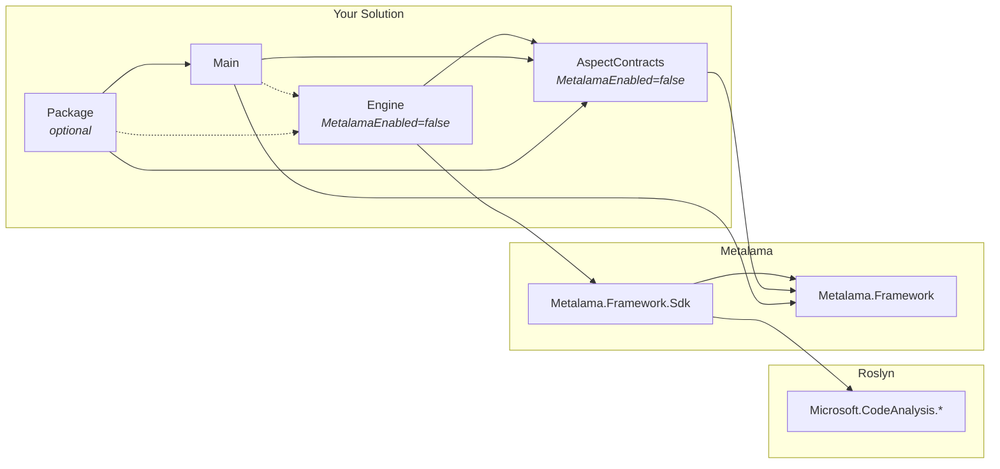

# SDK extension projects

Previous articles showed how to use `Metalama.Framework.Sdk` directly from your aspect projects. This approach is simple but has two drawbacks:

- It exposes the `Microsoft.CodeAnalysis` package references to your project or package consumers. These are large dependencies you might want to avoid flowing to your users.
- You can't have conditional compilation or conditional package references based on the target framework or Roslyn version.

For these situations, create extension assemblies.

## Project structure

A typical SDK extension implementation requires three projects, plus an optional packaging project:



| Project | Purpose | Package Reference |
|---------|---------|-------------------|
| **AspectContracts** | Defines the `IProjectService` interface | `Metalama.Framework` |
| **Engine** | Implements the service and factory | `Metalama.Framework.Sdk` |
| **Main** | Contains aspects that use the service | `Metalama.Framework` |
| **Package** | Bundles the extension as a NuGet package (optional) | `Metalama.Framework` |

This separation ensures the following:

- The AspectContracts project can be referenced by both the Engine and Main projects.
- The Engine project can use SDK APIs without affecting the Main project.
- The Main project loads the Engine as a Metalama extension.
- The Package project bundles everything for distribution without exposing SDK dependencies.

> [!NOTE]
> The AspectContracts and Engine projects must have `<MetalamaEnabled>false</MetalamaEnabled>` in their project files because they are compile-time-only projects that shouldn't be processed by Metalama.

## Creating an SDK extension

### Step 1. Create the AspectContracts project

Create a class library targeting `netstandard2.0` with `MetalamaEnabled` set to `false`:

[!code-xml[](~/code/Metalama.Documentation.SampleCode.Sdk/SdkExtension/MyExtension.AspectContracts/MyExtension.AspectContracts.csproj)]

Define your service interface:

[!code-csharp[](~/code/Metalama.Documentation.SampleCode.Sdk/SdkExtension/MyExtension.AspectContracts/IGreetingService.cs?range=3-999)]

Key points:

- The interface must inherit from <xref:Metalama.Framework.Services.IProjectService>.
- Mark the entire assembly with `[assembly: CompileTime]` since it's used at compile time.

### Step 2. Create the Engine project

Create another class library targeting `netstandard2.0` with `MetalamaEnabled` set to `false`. Reference `Metalama.Framework.Sdk`:

[!code-xml[](~/code/Metalama.Documentation.SampleCode.Sdk/SdkExtension/MyExtension.Engine/MyExtension.Engine.csproj)]

Implement the service:

[!code-csharp[](~/code/Metalama.Documentation.SampleCode.Sdk/SdkExtension/MyExtension.Engine/GreetingService.cs?range=3-999)]

### Step 3. Create the service factory

In the Engine project, create a factory class that implements <xref:Metalama.Framework.Engine.Services.IProjectServiceFactory> and export it using <xref:Metalama.Framework.Engine.Extensibility.ExportExtensionAttribute>:

[!code-csharp[](~/code/Metalama.Documentation.SampleCode.Sdk/SdkExtension/MyExtension.Engine/GreetingServiceFactory.cs?range=3-999)]

Key points:

- The `[assembly: ExportExtension(...)]` attribute registers the factory with Metalama.
- Use <xref:Metalama.Framework.Engine.Extensibility.ExtensionKinds.ServiceFactory> to indicate this is a service factory.
- The factory's <xref:Metalama.Framework.Engine.Services.IProjectServiceFactory.CreateServices*> method returns the service instances.

### Step 4. Configure the Main project

The Main project must:

1. Reference the AspectContracts project normally (for type visibility).
2. Load the Engine assembly as a Metalama extension.
3. Make the AspectContracts assembly available at compile time.

[!code-xml[](~/code/Metalama.Documentation.SampleCode.Sdk/SdkExtension/MyExtension/MyExtension.csproj)]

### Step 5. Use the service from an aspect

In the Main project, access the service through <xref:Metalama.Framework.Project.IProject.ServiceProvider>:

[!code-csharp[](~/code/Metalama.Documentation.SampleCode.Sdk/SdkExtension/MyExtension/GreetingAspect.cs?range=3-999)]

## Conditional compilation

To target different frameworks or Roslyn versions with different assemblies, include several assemblies in the package and use the `TargetFramework` and `TargetRoslynVersion` metadata on `MetalamaExtensionAssembly` to specify which build of the extension to load. This approach supports conditional compilation or different package reference sets.

```xml
<ItemGroup>
    <!-- Visual Studio (runs on .NET Framework) -->
    <MetalamaExtensionAssembly
        Include="$(MSBuildThisFileDirectory)../metalama/net472/MyExtension.Engine.4.8.0.dll"
        TargetFramework="net472"
        TargetRoslynVersion="4.8.0"/>
    <MetalamaExtensionAssembly
        Include="$(MSBuildThisFileDirectory)../metalama/net472/MyExtension.Engine.4.12.0.dll"
        TargetFramework="net472"
        TargetRoslynVersion="4.12.0"/>
    <MetalamaExtensionAssembly
        Include="$(MSBuildThisFileDirectory)../metalama/net472/MyExtension.Engine.5.0.0.dll"
        TargetFramework="net472"
        TargetRoslynVersion="5.0.0"/>

    <!-- dotnet build, Rider, and other modern hosts -->
    <MetalamaExtensionAssembly
        Include="$(MSBuildThisFileDirectory)../metalama/net8.0/MyExtension.Engine.4.8.0.dll"
        TargetFramework="net8.0"
        TargetRoslynVersion="4.8.0"/>
    <MetalamaExtensionAssembly
        Include="$(MSBuildThisFileDirectory)../metalama/net8.0/MyExtension.Engine.4.12.0.dll"
        TargetFramework="net8.0"
        TargetRoslynVersion="4.12.0"/>
    <MetalamaExtensionAssembly
        Include="$(MSBuildThisFileDirectory)../metalama/net8.0/MyExtension.Engine.5.0.0.dll"
        TargetFramework="net8.0"
        TargetRoslynVersion="5.0.0"/>
</ItemGroup>
```

Metalama loads the assembly that matches the Roslyn version used by the compiler or IDE. If no exact match is found, the assembly won't load.

> [!WARNING]
> When using `TargetRoslynVersion` metadata, ensure your version numbers exactly match the Roslyn versions and target frameworks that the specific Metalama build you're targeting supports. Metalama currently lacks a robust, forward-compatible selection mechanism for extension assemblies, and mismatched versions will cause build failures.

For details on `MetalamaExtensionAssembly` and `MetalamaCompileTimeAssembly`, see <xref:msbuild-properties>.

## Packaging as a NuGet package

When distributing your SDK extension as a NuGet package, include the extension assemblies and configure MSBuild to load them. This section describes the recommended package structure.

### Package folder structure

```text
MyExtension.nupkg
├── build/
│   └── MyExtension.props          # MSBuild props for direct package consumers
├── buildTransitive/
│   └── MyExtension.props          # MSBuild props for transitive package consumers
├── lib/
│   ├── netstandard2.0/
│   │   └── MyExtension.AspectContracts.dll  # AspectContracts assembly
│   └── net8.0/
│       └── MyExtension.dll                  # Main assembly with aspects
└── metalama/
    └── MyExtension.Engine.dll     # Extension assembly
```

> [!NOTE]
> The `metalama` folder path is arbitrary. Metalama does not impose a convention on where extension assemblies are stored in the package - only the `MetalamaExtensionAssembly` item path matters.

### Create the props file

Create a `.props` file in the `build` folder that defines the `MetalamaCompileTimeAssembly` and `MetalamaExtensionAssembly` items:

[!code-xml[](~/code/Metalama.Documentation.SampleCode.Sdk/SdkExtension/MyExtension.Package/build/MyExtension.props)]

For transitive consumers, create a `buildTransitive/MyExtension.props` that imports the main props file:

[!code-xml[](~/code/Metalama.Documentation.SampleCode.Sdk/SdkExtension/MyExtension.Package/buildTransitive/MyExtension.props)]

### Packaging project

Create a separate packaging project that includes the extension assemblies in the package. Use `TfmSpecificPackageFile` items to add assemblies to the package:

[!code-xml[](~/code/Metalama.Documentation.SampleCode.Sdk/SdkExtension/MyExtension.Package/MyExtension.Package.csproj)]

## ExportExtensionAttribute vs. MetalamaPlugInAttribute

The <xref:Metalama.Framework.Engine.MetalamaPlugInAttribute> attribute registers types that Metalama discovers automatically, such as aspect weavers and metric providers. This attribute only works in projects where `MetalamaEnabled=true`, which means Metalama compiles the project.

In contrast, <xref:Metalama.Framework.Engine.Extensibility.ExportExtensionAttribute> works with extension assemblies that Metalama doesn't compile (`MetalamaEnabled=false`). Use this attribute to export extension types such as service factories from these assemblies.

> [!div class="see-also"]
>
> **See also**
>
> * <xref:sdk>
> * <xref:aspect-weavers>
> * <xref:custom-metrics>
> * <xref:msbuild-properties>
> * <xref:Metalama.Framework.Engine.Services.IProjectServiceFactory>
> * <xref:Metalama.Framework.Engine.Extensibility.ExportExtensionAttribute>
> * <xref:Metalama.Framework.Engine.Extensibility.ExtensionKinds>
