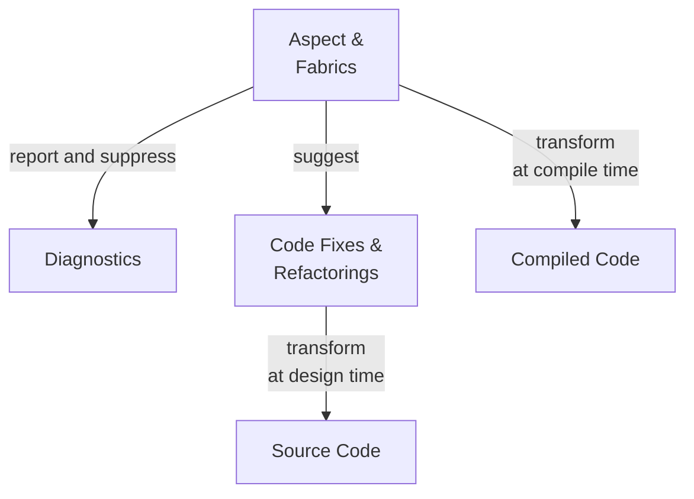

# Overview

> [!WARNING]
> This chapter hasn't been written yet.

This book will guide you through evaluating Metalama. It won't teach you how to deploy and use it, but rather why and whether it's suitable for you.

## Features

Metalama provides the following main features:

| Feature | Description |
|---------|-------------|
| **Aspect-Oriented Programming** | Encapsulate repetitive code patterns (such as logging, caching, `INotifyPropertyChanged`, multi-threading) into executable artifacts called _aspects_. Aspects add behaviors to your code at compile time, keeping your source code clean and concise—easier to read and maintain.
| **Code Generation**             | Generate repetitive code in the editor or at compile time instead of writing it manually. Create your own code actions or refactorings that appear in the lightbulb or screwdriver menu.
| **Code Validation**             | Verify that manually written code complies with team rules and conventions. Report diagnostics (warnings or errors) or suppress source code diagnostics.

> [!div class="see-also"]
>
> <xref:index>
> <xref:main-getting-started>
> <xref:conceptual>
> <xref:aspects>
